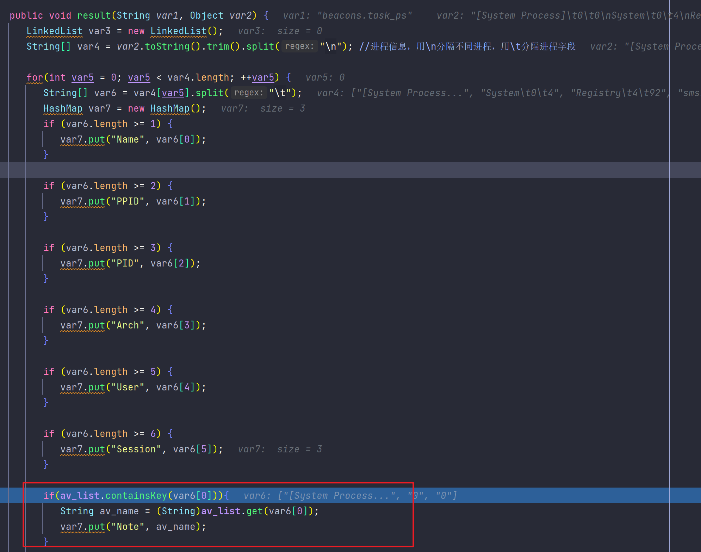
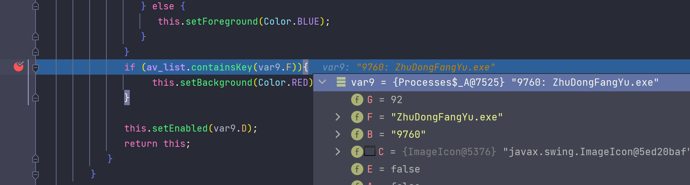
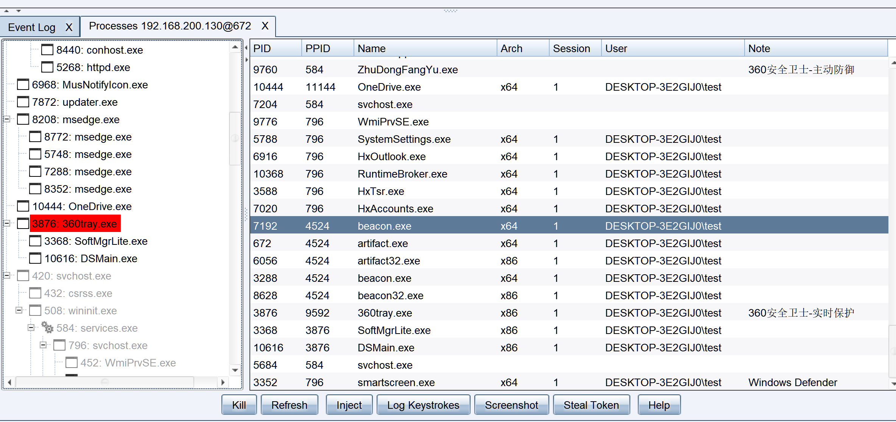

# 杀软进程染色
这是一个已经被插件实现的功能，比较简单，拿来练手。

进程名和名称对应关系来自：https://github.com/gh0stkey/avList

Cobalt Strike进程查看器的数据来源是`aggressor.windows.Processes`类，数组成员`cols`用来存储进程信息字段名，添加一列`Note`：
```java
protected String[] cols = new String[]{"PID", "PPID", "Name", "Arch", "Session", "User", "Note"};
```
最终进行处理的地方在`result()`，用一个HashMap存储，所以在插入时进行一个判断，符合进程名的就填入名称到`Note`字段，杀软进程名和名称对应也同样使用了HashMap存储：



染色部分在`getNewRenderer()`，`var9.F`存储进程名，同样对比然后设置背景色：



最终效果：

